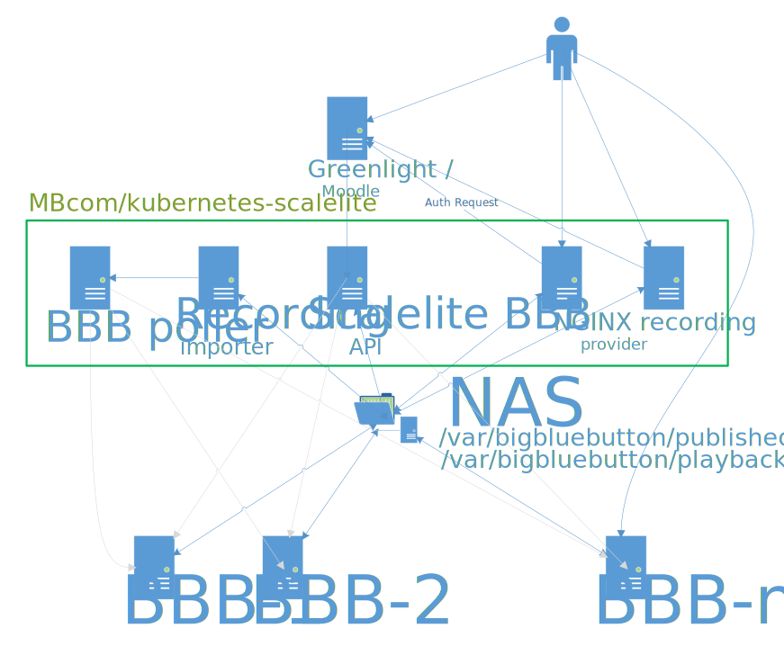

# Scalelite for Kubernetes Deployment

This version of scalelite is designed to run in high available kubernetes clusters. 
Currently we have the same features as upstream version v1.0.8.

## Extra features
* you need just to mount the same NFS share to `/var/bigluebutton/published` and `/var/bigbluebutton/playback` on each of your BBB Servers
* no need to additional post publish jobs
* in combination with https://github.com/MBcom/enforce-authentication-greenlight your recordings are protected by Greenlight (LDAP) authentication
* we use the current number of conference participants for calculating server load, instead of the number of running conferences so we are able to balance the load a little bit more granular
   


[BigBlueButton](https://docs.bigbluebutton.org/) is an open source web conferencing system for online learning.

Scalelite is an open source load balancer that manages a pool of BigBlueButton servers.  It makes the pool of servers appear as a single (very scalable) BigBlueButton server.  A front-end, such as [Moodle](https://moodle.org/plugins/mod_bigbluebuttonbn) or [Greenlight](https://github.com/bigbluebutton/greenlight), sends standard BigBlueButton API requests to the Scalelite server which, in turn, distributes those request to the least loaded BigBlueButton server in the pool.

A single BigBlueButton server that meets the [minimum configuration](http://docs.bigbluebutton.org/2.2/install.html#minimum-server-requirements) supports around 200 concurrent users.

For many schools and organizations, the ability to 4 simultaneous classes of 50 users, or 8 simultaneous meetings of 25 users, is enough capacity.  However, what if a school wants to support 1,500 users across 50 simultaneous classes?  A single BigBlueButton server cannot handle such a load.

With Scalelite, a school can create a pool of 4 BigBlueButton servers and handle 16 simultaneous classes of 50 users.  Want to scale higher, add more BigBlueButton servers to the pool.

BigBlueButton has been in development for over 10 years now.  The latest release is a pure HTML5 client, with extensive documentation.  There is even a BigBlueButton install script called [bbb-install.sh](https://github.com/bigbluebutton/bbb-install) that lets you setup a BigBlueButton server (with a Let's Encrypt certificate) in about 15 minutes.  Using `bbb-install.sh` you can quickly setup a pool of servers for management by Scalelite.

To load balance the pool, Scalelite periodically polls each BigBlueButton to check if it is reachable online, ready to receive [API](http://docs.bigbluebutton.org/dev/api.html) requests, and to determine its current load (number of currently running meetings).  With this information, when Scalelite receives an incoming API call to [create](http://docs.bigbluebutton.org/dev/api.html#create) a new meeting, it places the new meeting on the least loaded server in the pool.   In this way, Scalelite can balance the load of meeting requests evenly across the pool.

Many BigBlueButton servers will create many recordings.  Scalelite can serve a large set of recordings by consolidating them together, indexing them in a database, and, when receiving an incoming [getRecordings](https://docs.bigbluebutton.org/dev/api.html#getrecordings), use the database index to return quickly the list of available recordings.


## Architecture of Scalelite

There are several components required to get Scalelite up and running:

1. Multiple BigBlueButton Servers
2. Scalelite LoadBalancer Server
3. NFS Shared Volume
4. PostgreSQL Database
5. Redis Cache 
6. NGINX servers for provoding the recordings to users

An example Scalelite deployment will look like this:



### Minimum Server Requirements

For the Scalelite Server, the minimum recommended server requirements are:
- 4 CPU Cores
- 8 GB Memory

For **each** BigBlueButton server, the minimum requirements can be found [here](http://docs.bigbluebutton.org/2.2/install.html#minimum-server-requirements).
  
For the external Postgres Database, the minimum recommended server requirements are:
- 2 CPU Cores
- 2 GB Memory
- 20 GB Disk Space (should be good for tens of thousands of recordings)

For the external Redis Cache, the minimum recommended server requirements are:
- 2 CPU Cores
- 0.5GB Memory
- **Persistence must be enabled**

### Setup a pool of BigBlueButton Server

To setup a pool of BigBlueButton servers (minimum recommended number is 3), we recommend using [bbb-install.sh](https://github.com/bigbluebutton/bbb-install) as it can automate the steps to install, configure (with SSL + Let's Encrypt), and update the server when [new versions](https://github.com/bigbluebutton/bigbluebutton/releases) of BigBlueButton are released.

To help users who are behind restrictive firewalls to send/receive media (audio, video, and screen share) to your BigBlueButton server, you should setup a TURN server and configure each BigBlueButton server to use it.

Again, [bbb-install.sh](https://github.com/bigbluebutton/bbb-install#install-a-turn-server) can automate this process for you.

### Setup kubernetes Namespace
If you have not already created a namespace or do not want to use the same as for your Greenlight Kubernetes deployment - it is time to create it now.
```bash
kubectl create namespace <your scalelite namespace>
```
  
Now run the following:
```bash
sed -i 's/scalelite-ns/<your scalelite namespace>/g' ./kubernetes/*.yaml
```

### Setup a shared volume for recordings

Mount a the same shared folder to all BBB servers on `/var/bigluebutton/published` and `/var/bigbluebutton/playback`.
Make sure you copy existing data first to the NFS share before you over mount it.
  
Create now persistent volume in your kubernetes server:
```bash
sed -i 's/NAS-IP/<your NAS IP or DNS Name>/g' ./kubernetes/bbb-nas.yaml
sed -i 's/NFS-SHARE-PATH/<your NFS share path>/g' ./kubernetes/bbb-nas.yaml
kubectl apply -f ./kubernetes/bbb-nas.yaml
```

### Setup up a PostgreSQL Database
To create a PostgreSQL Database run the following. Make sure you have helm installed first.

```bash
# if you have not done before
# helm repo add bitnami https://charts.bitnami.com/bitnami
sed -i 's/POSTGRES-PASSWORD/<super secure postgres password>/g' ./kubernetes/scalelite-postgresql.values
helm install -n <your scalelite namespace> scalite-postgres -f ./kubernetes/scalelite-postgresql.values bitnami/postgresql
```

### Setup a Redis Cache

To create the Redis Cache run the following.

```bash
sed -i 's/REDIS-PASSWORD/<super secure redis password>/g' ./kubernetes/scalite-redis.values
helm install -n <your scalelite namespace> scalelite-redis -f ./kubernetes/scalite-redis.values bitnami/redis
```


### Deploying Scalelite Docker Containers

To deploy the Scalelite containers run the following:

```bash
sed -i 's/SECRET-KEY/<super secret key>/g ./kubernetes/*.yaml
sed -i 's/LOADBALANCER-SECRET/<the scaelite API key>/g ./kubernetes/*.yaml
sed -i 's/REDIS-PASSWORD/<super secure redis password>/g ./kubernetes/*.yaml
sed -i 's/POSTGRES-PASSWORD/<super secure postgres password>/g ./kubernetes/*.yaml
sed -i 's/conf.example.com/<your desired URL - maybe your Greenlight URL>/g ./kubernetes/*.yaml

kubectl apply -f ./kubernetes/ingress-video.yaml
kubectl apply -f ./kubernetes/nginx-videos-pdb.yaml
kubectl apply -f ./kubernetes/nginx-videos.yaml
kubectl apply -f ./kubernetes/scalelite-pdb.yaml
kubectl apply -f ./kubernetes/scalelite-service.yaml
kubectl apply -f ./kubernetes/scalelite.yaml
```

### Configure your Front-End to use Scalelite

To switch your Front-End application to use Scalelite instead of a single BigBlueButton server, there are 2 changes that need to be made

- `BigBlueButton server url` should be set to the url of your Scalelite deployment `http(s)://<your desired URL - maybe your Greenlight URL>/bigbluebutton/`
- `BigBlueButton shared secret` should be set to the `<the scaelite API key>` value 

## Configuration

#### Docker-Specific


* `POLL_INTERVAL`: Used by the "poller" image to set the interval at which BigBlueButton servers are polled, in seconds. Defaults to 60.
* `RECORDING_IMPORT_POLL_INTERVAL`: How often to check the recording spool directory for new recordings, in seconds (when running in poll mode). Defaults to 60.

#### Optional

* `INTERVAL`: Adjust the polling interval (in seconds) for updating server statistics and meeting status. Defaults to 60. Only used by the "poll" task.
* `WEB_CONCURRENCY`: The number of processes for the puma web server to fork. A reasonable value is 2 per CPU thread or 1 per 256MB ram, whichever is lower.
* `RAILS_MAX_THREADS`: The number of threads to run in the Rails process. The number of Redis connections in the pool defaults to match this value. The default is 5, a reasonable value for production.
* `RAILS_ENV`: Either `development`, `test`, or `production`. The Docker image defaults to `production`. Rails defaults to `development`.
* `BUILD_NUMBER`: An additional build version to report in the BigBlueButton top-level API endpoint. The Docker image has this preset to a value determined at image build time.
* `RAILS_LOG_TO_STDOUT`: Log to STDOUT instead of a file. Recommended for deployments with a service manager (e.g. systemd) or in Docker. The Docker image sets this by default.
* `REDIS_POOL`: Configure the Redis connection pool size. Defaults to `RAILS_MAX_THREADS`.
* `MAX_MEETING_DURATION`: The maximum length of any meeting created on any server. If the `duration` is passed as part of the create call, it will only be overwritten if it is greater than `MAX_MEETING_DURATION`.
* `RECORDING_SPOOL_DIR`: Directory where transferred recording files are placed. Defaults to `/var/bigbluebutton/spool`
* `RECORDING_WORK_DIR`: Directory where temporary files from recording transfer/import are extracted. Defaults to `/var/bigbluebutton/recording/scalelite`
* `RECORDING_PUBLISH_DIR`: Directory where published recording files are placed to make them available to the web server. Defaults to `/var/bigbluebutton/published`
* `RECORDING_UNPUBLISH_DIR`: Directory where unpublished recording files are placed to make them unavailable to the web server. Defaults to `/var/bigbluebutton/unpublished`
* `SERVER_HEALTHY_THRESHOLD`: The number of times an offline server needs to responds successfully for it to be considered online. Defaults to **1**. If you increase this number, you should decrease `POLL_INTERVAL`
* `SERVER_UNHEALTHY_THRESHOLD`: The number of times an online server needs to responds unsuccessfully for it to be considered offline. Defaults to **2**. If you increase this number, you should decrease `POLL_INTERVAL`

## Upgrading

To upgrade you must edit the used Docker images in `./kubernetes/scalelite.yaml` and apply the file with kubectl again after that.

## Administration

Scalelite comes with a set of commands to

* Add/remove BigBlueButton servers from the pool
* Trigger an immediate poll of all BigBlueButton servers
* Change the state of any BigBlueButton server to being `available` and `unavailable` (don't try to put new meetings on the server)
* Monitor the load of all BigBlueButton servers

Server management is provided using rake tasks which update server information in Redis.


### Show configured server details

```sh
./bin/rake servers
```

This will print a summary of details for each server which looks like this:

```
id: 2d2d674a-c6bb-48f3-8ad4-68f33a80a5b7
        url: https://bbb1.example.com/bigbluebutton/api
        secret: 2bdce5cbab581f3f20b199b970e53ae3c9d9df6392f79589bd58be020ed14535
        enabled
        load: 21.0
        load multiplier: 2.0
        online
```

Particular information to note:

* `id`: This is the ID value used when updating or removing the server
* `enabled` or `disabled`: Whether the server is administratively enabled. See "Enable/Disable servers" below.
* `load`: The number of meetings on the server. New meetings will be scheduled on servers with lower load. Updated by the poll process.
* `online`: Whether the server is responding to API requests. Updated by the poll process.

### Add a server

```sh
./bin/rake servers:add[url,secret,loadMultiplier]
```

The `url` value is the complete URL to the BigBlueButton API endpoint of the server. The `/api` on the end is required.
You can find the BigBlueButton server's URL and Secret by running `bbb-conf --secret` on the BigBlueButton server.

The `loadMultiplier` can be used to give individual servers a higher or lower priority over other servers. A higher loadMultiplier should be placed on the weaker servers. If not passed, it defaults to a value of `1`.

This command will print out the ID of the newly created server, and `OK` if it was successful.
Note that servers are added in the disabled state; see "Enable a server" below to enable it.

### Remove a server

```sh
./bin/rake servers:remove[id]
```

Warning: Do not remove a server which has running meetings! This will leave the database in an inconsistent state.
You should either wait for all meetings to end, or run the "Panic" function first.

### Disable a server

```sh
./bin/rake servers:disable[id]
```

Mark the server as disabled.
When a server is disabled, no new meetings will be started on the server.
Any existing meetings will continue to run until they finish.
The Poll process continues to run on disabled servers to update the "Online" status and detect ended meetings.
This is useful to "drain" a server for updates without disrupting any ongoing meetings.

### Enable a server

```sh
./bin/rake servers:enable[id]
```

Mark the server as enabled.

Note that the server won't be used for new meetings until after the next time the Poll process runs to update the load information.

### Panic a server

```sh
./bin/rake servers:panic[id]
```

Disable a server and clear all meeting state.
This method is used to recover from a crashed BigBlueButton server.
After the meeting state is cleared, anyone who tries to join a meeting that was previously on this server will instead be directed to a new meeting on a different server.

### Edit the load-multiplier of a server

```sh
./bin/rake servers:loadMultiplier[id,newLoadMultiplier]
```

Sets the load_multiplier for a BigBlueButton server.

The `loadMultiplier` can be used to give individual servers a higher or lower priority over other servers. A higher loadMultiplier should be placed on the weaker servers.

After changing the server needs to be polled at least once to see the new load.

### Poll all servers

```sh
./bin/rake poll:all
```

When you add a server to the pool, it may take upwards of 60 seconds (default value for `INTERVAL` for the background server polling process) before Scalelite marks the server as `online`.
You can run the above task to have it poll the server right away without waiting.

### Check the status of the entire deployment

```sh
./bin/rake status
```

This will print a table displaying a list of all servers and some basic statistics that can be used for monitoring the overall status of the deployment

```
     HOSTNAME        STATE   STATUS  MEETINGS  USERS  LARGEST MEETING  VIDEOS
 bbb1.example.com  enabled   online        12     25                7      15
 bbb2.example.com  enabled   online         4     14                4       5
```


## Getting Help

For commercial help with setup and deployment of Scalelite, contact us at [Blindside Networks](https://blindsidenetworks.com/scaling-bigbluebutton/).

# Contributions
Contributions are welcome to that project.
